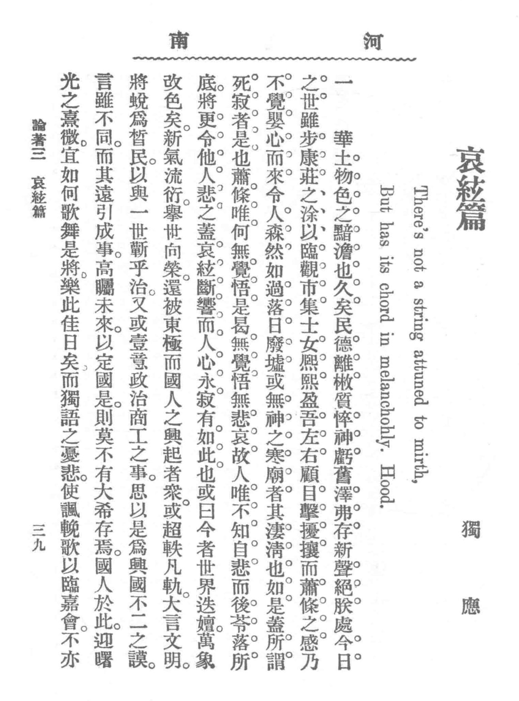
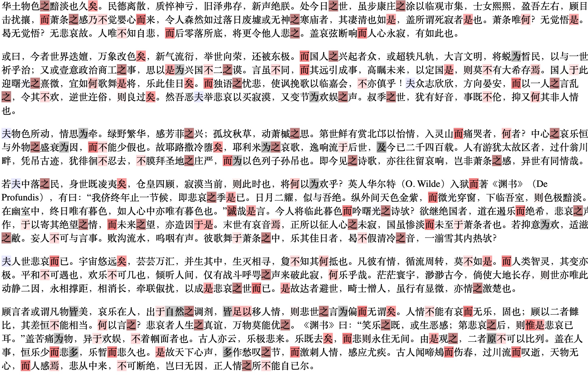

# Four Hands Playing in Unison

[](https://codeberg.org/hainingwang/four_hands/src/branch/main/README.md)
[](https://codeberg.org/hainingwang/four_hands/src/branch/main/README.zh.md)

This repository hosts the corpus and scripts for reproducing the findings of *Four Hands Playing in Unison: A Study 
on Zhou Zuoren's Collaboration with Lu Xun in 'The Strings of Melancholy'*.

We found evidence suggesting that *The Strings of Melancholy*, conventionally attributed solely to Zhou Zuoren, was 
likely a collaborative work with Lu Xun:

- Passage 5 is most likely Zhou Zuoren's solo work.
- Passage 1 is highly likely to have been written solely by Lu Xun.
- The remaining passages display a strong blend of styles, suggesting close collaboration between the brothers.

not written solely by Zhou Zuoren. Please refer to our [manuscript](#citation) for details.



## Reproduction

```python3.10
python3.10 -m venv .venv
source .venv/bin/activate
python -m pip install -r requirements.txt
python -m run
```


## Corpus

| Split      | Title                                             | Author/Pseudonym     |
|------------|---------------------------------------------------|----------------------|
| Train      | Lessons from the History of Science (科学史教篇)       | Lu Xun               |
|            | On the Aberrant Development of Culture (文化偏至论)    | Lu Xun               |
|            | Preface to Midst the Wild Carpathians (《匈奴奇士录》序)  | Zhou Zuoren          |
|            | Preface to Charcoal Drawing (《炭画》序)               | Zhou Zuoren          |
|            | Preface to The Lost History of Red Star (《红星佚史》序) | Zhou Zuoren          |
|            | Preface to The Yellow Rose (《黄蔷薇》序)               | Zhou Zuoren          |
|            | A Brief Discussion on Fairy Tales (童话略论)          | Zhou Zuoren          |
|            | A Study on Fairy Tales (童话研究)                     | Zhou Zuoren          |
| Validation | On Radium (说鈤)                                    | Lu Xun               |
|            | On the Power of Mara Poetry (摩罗诗力说)               | Lu Xun               |
|            | Preface to Qiucao Garden Diary (《秋草园日记》序)         | Zhou Zuoren          |
|            | An Addendum to Yisi Diary (乙巳日记附记一则)              | Zhou Zuoren          |
|            | A Glimpse of Jiangnan Examinees (江南考先生之一斑)        | Zhou Zuoren          |
|            | Plight and Broil in a Steamboat (汽船之窘况及苦热)        | Zhou Zuoren          |
|            | Looking at the Land of Yue (望越篇)                  | Zhou Zuoren & Lu Xun |
| Test       | The Strings of Melancholy (哀弦篇; as a whole)       | Du Ying              |
|            | Passage 1, The Strings of Melancholy (哀弦篇)        | Du Ying              |
|            | Passage 2, The Strings of Melancholy (哀弦篇)        | Du Ying              |
|            | Passage 3, The Strings of Melancholy (哀弦篇)        | Du Ying              |
|            | Passage 4, The Strings of Melancholy (哀弦篇)        | Du Ying              |
|            | Passage 5, The Strings of Melancholy (哀弦篇)        | Du Ying              |
|            | Passage 6, The Strings of Melancholy (哀弦篇)        | Du Ying              |


## Visualization



Consider Passage 1 of *The Strings of Melancholy* as an example. Characters in reddish hues indicate features 
that favor Lu Xun as the author, while gray characters suggest Zhou Zuoren's authorship. The darker the shade, the 
greater the absolute value of the weights associated with each feature. Notably, features favoring Lu Xun are dispersed 
throughout. In fact, the first section of *The Strings of Melancholy* is predicted to have been authored by Lu Xun with 
a probability of 0.976. 

Check more visualization at folder 
[visualization](https://codeberg.org/hainingwang/four_hands/src/branch/main/visualization).

## License

The corpus is designated to the public domain. All other materials are licensed under 0BSD.

## Citation

TODO


## Contact
- [rwxiexin@shnu.edu.cn](mailto:rwxiexin@shnu.edu.cn) for general questions. 
- [hw56@indiana.edu](mailto:hw56@indiana.edu) for reproduction.

## Acknowledgements

This project is supported by the National Social Science Foundation of China (22CTQ041).